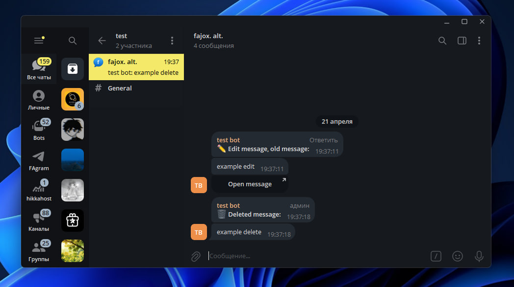

<h1>💫 NekoSpy 2.0</h1>

***Sends you deleted, edited, and self-destructing messages from users organized by personal chat topics***

*To save self-destructing messages, you must reply to them with a message* 

## ⬇️ Install

### 🐍 Install Python 3.12 and pip

### ⌨️  Clone repository and install libraries

<pre><code>git clone https://github.com/fajox1/nekospy
cd nekospy
pip install -r requirements.txt</code></pre>

### 💻 Configure config

- Rename `example.env` to `.env`
- Get `BOT_TOKEN` in [@BotFather](https://t.me/BotFather)
- Get your id into `ADMIN_ID` via [@username_to_id_bot](https://t.me/username_to_id_bot)
- Create chat with topics and get it's id into `LOG_CHAT_ID` with [@username_to_id_bot](https://t.me/username_to_id_bot)
- Add your bot to log chat with admin rigts (including **change topics**)
- Turn on ***Business mode*** for bot in [@BotFather](https://t.me/BotFather)
- Add your bot to your account (**Open Settings** → **Telegram Business** → **ChatBots**) (require ***Telegram premium***)
- Install **[Redis DB](https://redis.io/docs/latest/operate/oss_and_stack/install/archive/install-redis/)** or run in docker (`docker run -p 6379:6379 -d redis`) and get it's `REDIS_HOST`, `REDIS_PORT`, `REDIS_PASSWORD`

<pre><code>BOT_TOKEN = 
ADMIN_ID = 

LOG_CHAT_ID = 

REDIS_HOST =
REDIS_PORT =
REDIS_PASSWORD =</code></pre>

*Put your changes into `.env` file*

### 🔥 Start it

Type `python3 -m nekospy`

<i>Lisenced under GPL GNU 3.0 
Developer: <a href="https://t.me/fajox">@fajox</a></i>
